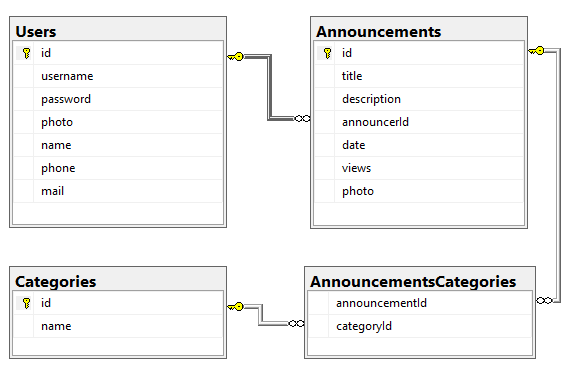

# announcements-api

## REST API for simple announcement board.

Features:
- user registration
- user login
- viewing, adding, removing, modifying announcements for authenticated users
- viewing announcements for unauthenticated users
- filtering announcements by category
- sorting announcements by date and views

